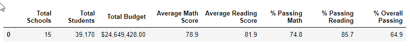
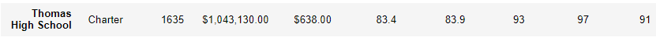
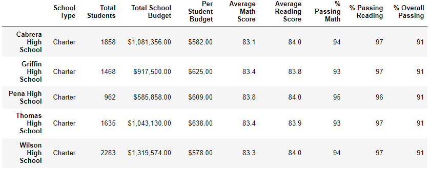
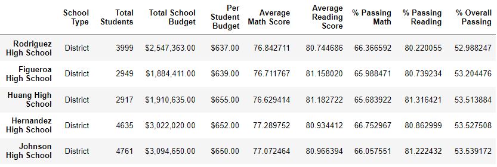
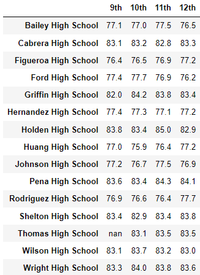
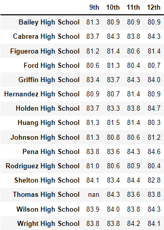
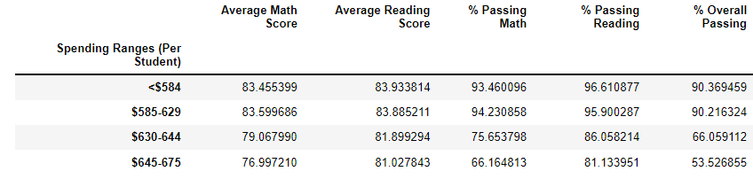
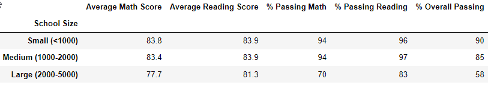
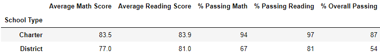
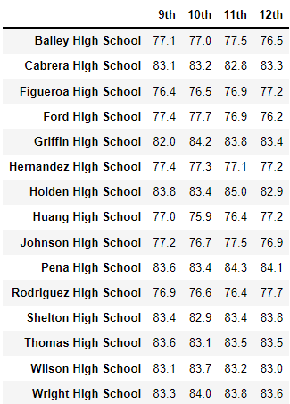

# PyCitySchools with Pandas

## School District Analysis Report
` `  
### The purpose of this report is to address concerns about reading and math scores within the district at Thomas High School. The scores of the ninth graders are of concern. The analyses in the report will be based on a comparison of the Module 4 full district results compared to an analysis run on an updated data set with the average.
` `  
## School District Results - updated

### District Level Summary DataFrame


### School Level Summary DataFrame


### Top 5 Performing Schools


### Bottom 5 Performing Schools


### Average math scores by grade level
#### Ninth graders replaces to NaN


### Average reading scores by grade level
#### Ninth graders replaces to NaN


### Scores by school spending per student


### Scores by school size


### Scores by school type


## Code Analysis to create new data file
#### Only the last 2 blocks of code below were used in the Challenge. The other pieces of code were to demonstrate completion of Deliverable 1 Requirements. The last blocks of code selects the Thomas 9th graders Math and reading scores and set them all to NaN.
` `  
```python
# Use the loc method on the student_data_df to select Thomas High School
student_data_df.loc[(student_data_df["school_name"] == "Thomas High School")]
```
```python
# Use the loc method on the student_data_df to select 9th graders
student_data_df.loc[(student_data_df["grade"] == "9th")]
```
```python
# Use the loc method on the student_data_df to select all the reading scores from the 9th grade at Thomas High School 

student_data_df.loc[
    (student_data_df["school_name"] == "Thomas High School") & (student_data_df["grade"] == "9th"),"reading_score"]
```
```python
# Use the loc method on the student_data_df to select all the math scores from the 9th grade at Thomas High School
student_data_df.loc[
    (student_data_df["school_name"] == "Thomas High School") & (student_data_df["grade"] == "9th"),"math_score"]
```
```python
# Use the loc method on the student_data_df to select all the reading scores from the 9th grade at Thomas High School and replace them with NaN. Here is the website reference for the np=NaN code:
# https://stackoverflow.com/questions/34794067/how-to-set-a-cell-to-nan-in-a-pandas-dataframe

student_data_df.loc[
    (student_data_df["school_name"] == "Thomas High School") & (student_data_df["grade"] == "9th"),"reading_score"] = np.NaN
```
```python
# Use the loc method on the student_data_df to select all the math scores from the 9th grade at Thomas High School and replace them with NaN.
student_data_df.loc[
    (student_data_df["school_name"] == "Thomas High School") & (student_data_df["grade"] == "9th"),"math_score"] = np.NaN
```

## Results based on NEW (Thomas 9th grade scores removed) vs OLD analyses (All students)

- District Summary Changes
    #### There are 461 9th graders at Thomas High school. This represents only 1.2% (461/39,170) of the school district high school students

Old Math score |New Math score |Old Reading score |New Reading score
---|---|---|---
79.0|78.9|81.9|81.9

- School Summary Changes

Old Math score |New Math score |Old Reading score |New Reading score
---|---|---|---
83.4|83.4|83.8|83.9

- Thomas High School results vs other schools
    
    ####
     Thomas High School remains the 4th top school in the overall passing ranks.

- Math and Reading Changes by grade
#### New grade level results. Thomas ninth graders are all missing in the new analyses.
 

#### Old grade level results. All other schools and grade level scores remain the same since no other data were changed for other schools or grades.


- Math and Reading Changes by school spending

- Math and Reading Changes by school size

- Math and Reading Changes by school type