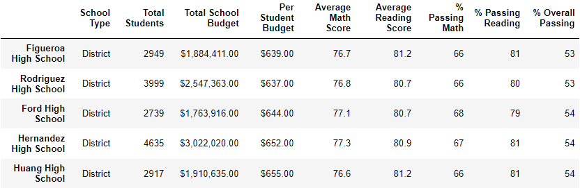

# PyCitySchools with Pandas

## School District Analysis Report

### The purpose of this report is to address concerns about reading and math scores within the district at Thomas High School. The scores of the ninth graders are of concern. The analyses in the report will be based on a comparison of the Module 4 full district results compared to an analysis run on a subset of the data with 9th grade scores removed.

## School District Results - updated

### District Level Summary DataFrame

### School Level Summary DataFrame

### Top 5 performing schools

### Bottom 5 performing schools

