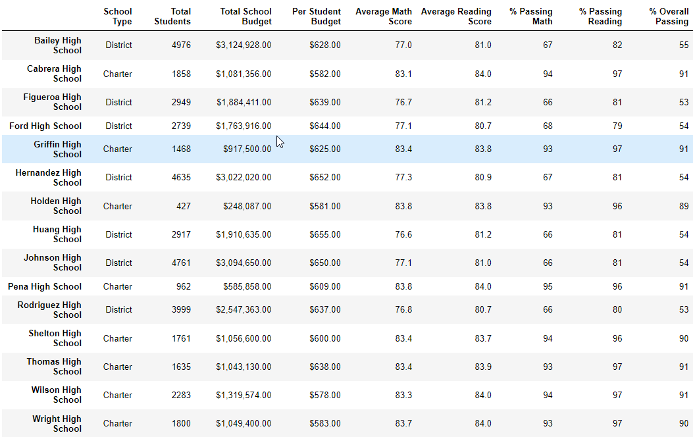
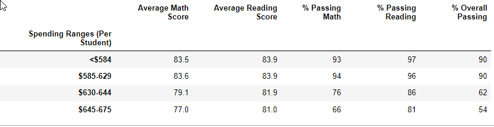
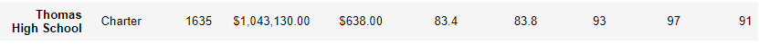
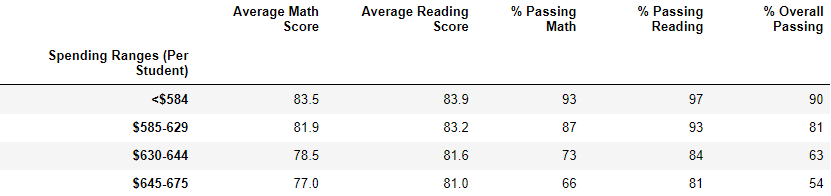
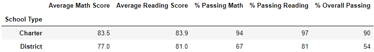

# PyCitySchools with Pandas

## School District Analysis Report
` `  
### The purpose of this report is to address concerns about reading and math scores within Thomas High School. The scores of the ninth graders there were of concern. The analyses in the report was based on a comparison of the Module 4 full district results compared to an analysis run on an updated data set with the Thomas High School 10-12th grade percent passing (Reading, Math and Overall) replacing the Thomas High school results for all grades. The Thomas High School 9th grade scores were set to missing. These changes were implemented to determine if there was any evidence of academic dishonesty.
` `  
## School District Results - New results

### District Level Summary DataFrame


### School Level Summary DataFrame


### Top 5 Performing Schools


### Bottom 5 Performing Schools


### Average math scores by grade level
#### Ninth graders replaces to NaN


### Average reading scores by grade level
#### Ninth graders replaces to NaN


### Scores by school spending per student


### Scores by school size


### Scores by school type


## Code Analysis to create new data file
#### Only the last 2 blocks of code below were used in the Challenge. The other pieces of code were to demonstrate completion of Deliverable 1 Requirements. The last blocks of code selects the Thomas 9th graders Math and reading scores and set them all to NaN.
` `  
```python
# Use the loc method on the student_data_df to select Thomas High School
student_data_df.loc[(student_data_df["school_name"] == "Thomas High School")]
```
```python
# Use the loc method on the student_data_df to select 9th graders
student_data_df.loc[(student_data_df["grade"] == "9th")]
```
```python
# Use the loc method on the student_data_df to select all the reading scores from the 9th grade at Thomas High School 

student_data_df.loc[
    (student_data_df["school_name"] == "Thomas High School") & 
    (student_data_df["grade"] == "9th"),"reading_score"]
```
```python
# Use the loc method on the student_data_df to select all the math scores from the 9th grade at Thomas High School
student_data_df.loc[
    (student_data_df["school_name"] == "Thomas High School") & 
    (student_data_df["grade"] == "9th"),"math_score"]
```
```python
# Use the loc method on the student_data_df to select all the reading scores from the 9th grade at Thomas High School and replace them with NaN. Here is the website reference for the np=NaN code:
# https://stackoverflow.com/questions/34794067/how-to-set-a-cell-to-nan-in-a-pandas-dataframe

student_data_df.loc[
    (student_data_df["school_name"] == "Thomas High School") & 
    (student_data_df["grade"] == "9th"),"reading_score"] = np.NaN
```
```python
# Use the loc method on the student_data_df to select all the math scores from the 9th grade at Thomas High School and replace them with NaN.
student_data_df.loc[
    (student_data_df["school_name"] == "Thomas High School") & 
    (student_data_df["grade"] == "9th"),"math_score"] = np.NaN
```

## Results based on NEW analyses vs OLD analyses 
### NEW -- Thomas 9th grade scores set to missing and Thomas % passing (math, reading and overall ) set to respective percents for 10-12th graders.
### OLD -- Full original data used for Thomas High School

` `  

- ## District Summary Changes
    #### There are 461 9th graders at Thomas High school. This represents only 1.2% (461/39,170) of the school district high school students. You would not expect a large change in the district level results. No changes are seen in the District results.

    #### New
    

    #### Old
    

- ## School Summary Changes
    #### There was a very small change in the Average reading scores for Thomas High School. The new average reading score went up from 83.8 to 83.9. All other metrics remained the same when rounded to one or zero decimal places.

    #### New
    

    #### Old
    

- ## Thomas High School results vs other schools
    
    ####
    #### Thomas High School remained the 4th top school in the overall passing ranks.

    

- ## Math and Reading Changes by grade
    #### The only changes in the grade levels average scores was in the new analysis where all of the Thomas 9th grade scores are missing (NaN).
` ` 

#### New grade level results for MATH. Thomas ninth graders are all missing in the new analyses.
 

#### Old grade level results for MATH. All other schools and grade level scores remain the same since no other data were changed for other schools or grades.


#### New grade level results for READING. Thomas ninth graders are all missing in the new analyses.
 

#### Old grade level results for READING. All other schools and grade level scores remain the same since no other data were changed for other schools or grades.


- ## Math and Reading Changes by school spending
    #### Thomas High School is in the $630-644 per capita spending category. There were changes in all of the metrics. The average Math scores went up (78.5 to 79.1). The percent passing math went up (73% to 76%). The average reading scores went up (81.6 to 81.9) and the percent passing reading went up (84% to 86%). The Percent passing overall dropped (63% to 62%).
    #### New
    
    #### Old
    

- ## Math and Reading Changes by school size
    #### Thomas High School is classified as a Medium sized school. The only change in any of the metrics for Medium school was the overall percent passing which dropped from 91% to 85%.
    #### New
    
    #### Old
    

- ## Math and Reading Changes by school type
    #### Thomas High School is a Charter school. The only change in any of the metrics for Medium school was the overall percent passing which dropped from 90% to 87%.
    #### New
    
    #### Old
    

    ## Summary of the results

    ### It would be hypothsized that if there were evidence of academic dishonesty in the Thomas 9th graders, their scores would be artificially high (unlikely that cheaters would lower their scores). When the scores are removed it would be expected that the average Reading and Math scores would go down. Also it would be expected that the percent passing would go down if the 9th grade results artificially increased those metrics due to score altering. There seems to be very little evidence of cheating based on school level changes. There were very small changes seen in the grouping analyses with the groups containing Thomas High School.

1. The school level analysis of Thomas changed in only one of the metrics. The average reading score went UP from 83.8 to 83.9. If the scores had been altered to cheat it would be expected that these scores would go down. It is clear from the grade level average scores at Thomas that the 9th grades scores are very much in line with the other grades as seen in the tables below.
#### Math scores for Thomas

9th|10th|11th|12th
---|---|---|---
83.6|83.1|83.5|83.5

#### Reading scores for Thomas

9th|10th|11th|12th
---|---|---|---
83.7|84.3|83.6|83.8

2. The overall school district results did not change with the new analyses. As stated above, Thomas High School 9th graders represent only 1.2% (461/39,170) of the school district high school students. It would be very hard to determine any malfeasance in one grade level within a large school district.

2. The school rankings for top performing schools did not change with the new analyses. Thomas High School's rank remained at 4th. If the 9th grade scores were a drastic change it may be expected to lower Thomas' rank with the updated analysis.

1. The district scores by school spending for the per capita category $630-644 schools like Thomas showed no evidence of artificially raised scores. The average scores for math and reading went UP as did the percent passing math and reading. The only metric that went DOWN was the percent passing overall and the change was very small (63% to 62%). There is an interesting relationship in this table (not related to cheating). There seems to be a negative correlation with school spending and outcomes. In every category the metrics are best in the <$584 perstudent spending. Maybe the district needs to investigate why schools with lower funding are scoring better. The trend is especially striking in the % Passing Overall.

    

1. The district scores by school size for the Medium sized like Thomas showed no evidence of artificially raised scored as well. The only metric that changed was the percent passing overall which went DOWN (91% to 85%). Larger schools fare worse than small school for all metrics. This result seems to make sense with student:teacher ratio issues. 

1. The district scores by school type for Charter Schoold like Thomas showed no evidence of artificially raised scored as well. The only metric that changed was the percent passing overall which went DOWN slightly (90% to 87%). Charter schools scored much better than the District schools. 
#### A better way to determine altered scores would be to look at classroom level scores at Thomas High School. Or look at scores over time to see if there is a blip in the scores over time. 


